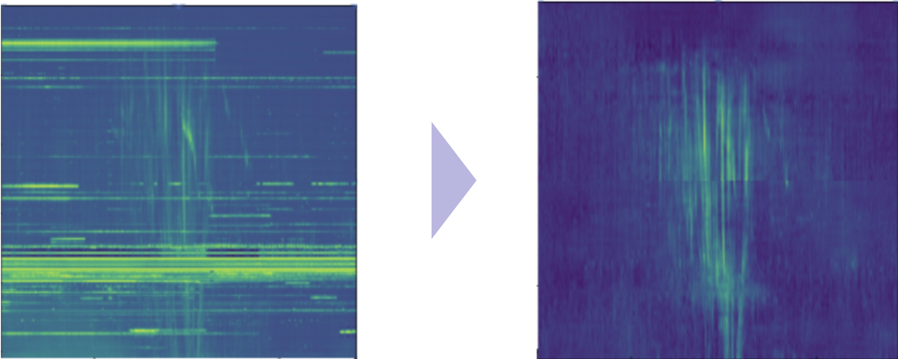

<p align="center">
   
</p>

<p align="center">
   
</p>

pix2pix を用いて [NenuFAR](https://pparc.gp.tohoku.ac.jp/hfvhf-20190921/) から提供されたデータからオーロラ電波を抽出するモデルを作成し, ノイズを含むオーロラ電波画像をノイズを除去した画像に再生成します.

<p align="center">
   
</p>

このリポジトリではデータの前処理・訓練済みモデルの適用を行います.
学習は [pix2pix](https://github.com/junyanz/pytorch-CycleGAN-and-pix2pix) のオリジナルのリポジトリを改造して **Ubuntu22.04** を使用しました.

このリポジトリはいわば実行ファイルの集合なので, データを格納するディレクトリを別に準備する必要があります.

## STRUCTURE

### .

ルートディレクトリ直下にスクリプトファイルを配置しています.主にこれらのファイルを実行することでリポジトリを利用可能です.

### ./pix2pix

配下にモデルの学習で得られたパラメータのバイナリファイル(latest_net_G.pth)を配置します.ファイル名は latest_net_G.pth 以外は設定しないでください.

### ./src

配下で自作モジュールを管理します.ここで作成したモジュールはスクリプトファイルでインポートされモジュールとして利用されます.もし, 新たに追加したいモジュールがあれば **/src** 以下に作成し, それをスクリプトファイルで実行するようにするのが良いです.

## TRAINING

Ubuntu22.04 を [WSL2](https://qiita.com/matarillo/items/61a9ead4bfe2868a0b86) 上で起動して訓練を行います.環境構築は [miniconda](https://docs.conda.io/projects/miniconda/en/latest/) を使って仮想環境を用いて行います.

```
Ubuntu22.04で以下と同様の環境を構築するためのYAMLファイルを作成予定です.
```

## OPERATION

学習が完了している OR 私がすでに学習を行い、出力した重みバイナリファイル(latest_net_G.pth)をあらかじめ Drive からダウンロードしていれば、macOS や Windows 上で pix2pix のテストを行うことが可能となります.
まず, データセットを作成する前にパッケージのインストールを以下のコマンドから行います.
ルートディレクトリ上で実行してください.
また、 **使用しているホスト OS により参照する YAML ファイルが異なる** ので注意してください.

**macOS**

```
$ conda env create -f osx_environment.yml
```

**Windows11**

```
$ conda env create -f win_environment.yml
```

実行されたら **aurora_analysis** という miniconda 仮想環境が作成されていることを以下のコマンドを実行して確認します.

```
$ conda info -e
```

## SETTINGS

実際に画像を再生成する際は抽出したニューラルネットワークのパラメータを格納したバイナリファイル(latest_net_G.pth)を参照し, **pix2pix/networks.py** にパラメータを適用してモデルを利用します.
まず, /pix2pix 直下にモデルの訓練で作成した **latest_net_G.pth** を配置します.これでモデルのパスが通りました.

次に, データを格納するための **data**ディレクトリをルートディレクトリと同じ階層に作成します.その後, 以下の階層をもとに各サブディレクトリを作成していきます.

```
.
├── cdf
├── fits
├── out
    ├── cdf
    ├── fits
    ├── random
    │   ├── cdf
    │   ├── cdf1
    │   ├── cdf2
    │   ├── fits
    │   └── noise_jpg
    ├── separate
    ├── test
    │   ├── A
    │   └── B
    └── train
        ├── A
        └── B
```

用いるデータをセットします.**./cdf** もしくは **./fits** 配下に[日付]/[その日付の CDF もしくは FITS ファイル]としてファイルを以下のようにセットします.

```
├── 19910101
    └── srn_nda_routine_jup_edr_199101012204_199101020603_V12.cdf
```

以上でセッティングは終了です.

## APPLY

スクリプトファイルを実行し, モデルを使用します.それぞれのファイルの役割は以下の通りです.

### main.py

基本的に使うことはありませんが, 実験的に行いたいことがあれば活用してください.

### calculate_filter.py

シグナルとノイズの切り分けの基準となる(filter)を見つけるためのグラフを描画するファイル.
引数は以下の通り.
--date [データの日付]

### calculate_rsn.py

calculate_filter.py で算出した filter を用いて SN 比を強度に直して計算するファイル.
引数は以下の通り. <br>
--date [データの日付]

### prepare_for_training.py

pix2pix の学習のためのデータを準備するファイル.Nancay のシグナル(cdf)-NenuFAR のノイズ(fits)もしくは Nancay のシグナル(cdf)-Nancay のノイズ(cdf)でデータを作成できる.
引数は以下の通り. <br>

1. Nancay のシグナル(cdf)-NenuFAR のノイズ(fits)で作成 <br>
   --cdf_date [Nancay のシグナルとするデータの日付] <br>
   --fits_date [NenuFAR のノイズとするデータの日付]

2. Nancay のシグナル(cdf)-Nancay(cdf) のノイズで作成 <br>
   --cdf1_date [Nancay のシグナルとするデータの日付] <br>
   --cdf2_date [Nancay のノイズとするデータの日付]

--random_file_num [データセット作成する際にランダムで切り取る画像の数] <br>
--integration_file_num [random_file_num で切り取った画像をランダムに組み合わせ最終的に作成するデータセットの数] <br>

実行例

```
$ python prepare_for_training.py --cdf_date 20161001 --fits_date 20201216 --random_file_num 10000 --integration_file_num 5000
```

### reconstruct.py

filter をかけて画像のコントラストを調整するファイル.そのまま/data/out に保存される.
引数は以下の通り. <br>

--date [モデルを適用するデータの日付] <br>
--extension [データの拡張子を fits か cdf で指定] <br>
--filter_height [0~255 で設定.設定した高さより低い dB は 0 に置き換えコントラストを上げる.デフォルト値は 0]

### sanitize_training_data.py

prepare_for_training.py によって生成された画像を削除するファイル.学習データセットを作成した時に出た残骸を処理する.

### show_current_data.py

生データを画像として表示したい時に実行するファイル.
引数は以下の通り.<br>

--date [モデルを適用するデータの日付] <br>
--extension [データの拡張子を fits か cdf で指定] <br>
--highlight [値は引数に取らず, --highlight だけを記述.画像を 256px*256px で切り抜く際に参考にするターゲットを表示(ターゲットの座標はファイル内で変更できる)]
